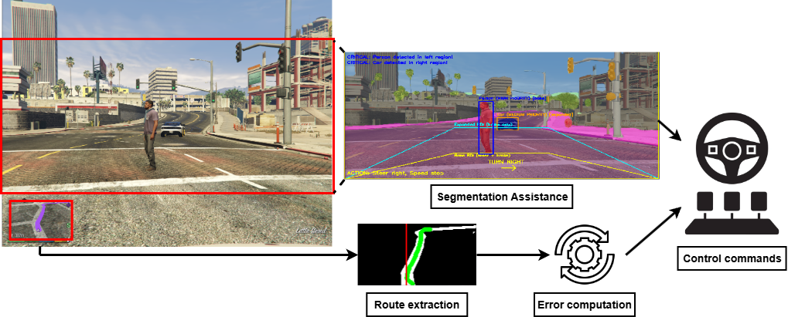

<h1 align="center">Autonomous Navigation in GTA V via Minimap-Guided Control and Safety Overrides</h1>

This project implements a modular autonomous driving system for Grand Theft Auto V by processing in-game route overlays to generate steering and speed commands, while a semantic segmentation safety layer continuously monitors the environment to handle hazards such as road departures, nearby pedestrians and vehicle conflicts.

<p align="center">
  
  <br>
  <em>Overall system pipeline. The route following module produces steering and speed targets; the segmentation module can override them when safety hazards are detected.</em>
</p>

<h2 align="center">Demonstration video</h2>

<p align="center">
  <a href="https://www.youtube.com/watch?v=i0YCsQf_Nr4">
    
  </a>
</p>

### Prerequisites

- Python 3.10+
- Git

### Setup Instructions

1. **[Install PyTorch](https://pytorch.org/get-started/locally/)**

2. **Clone the repository**
```bash
   git clone https://github.com/v33to/Autonomous-navigation-in-GTA-V.git
```

3. **Install dependencies**
```bash
   pip install -r requirements.txt
```
